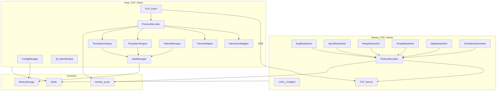
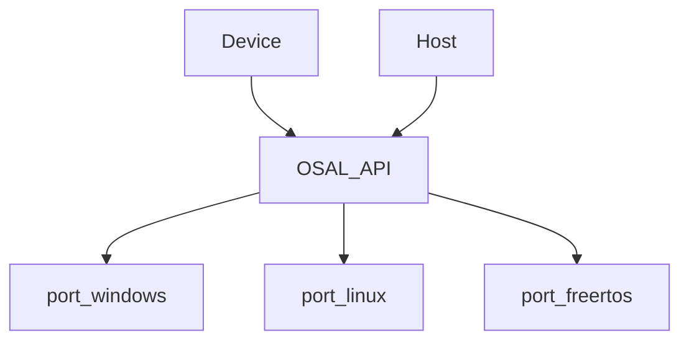
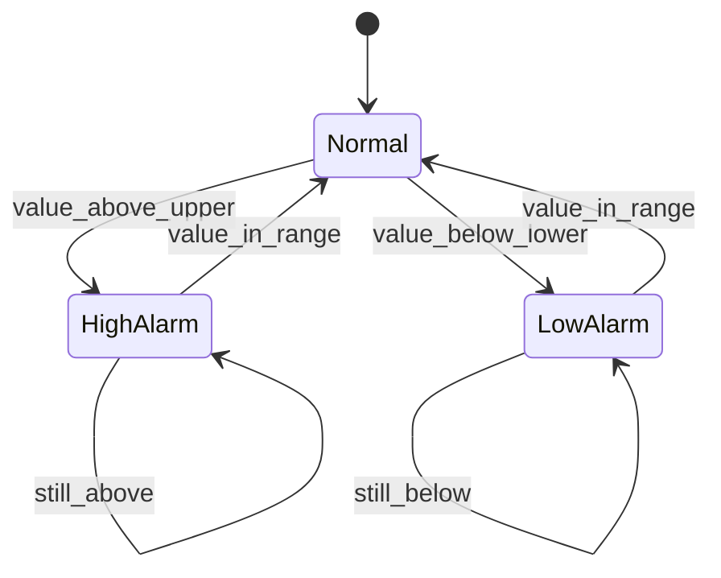
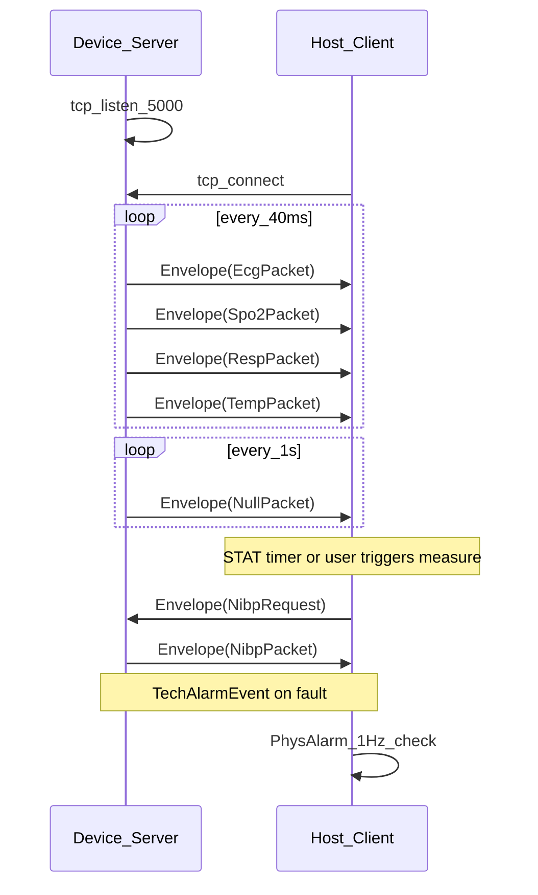
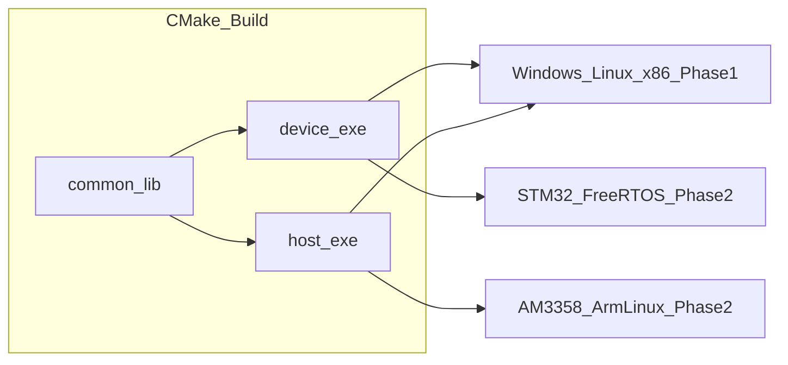

# Architecture Design Document

**Project:** MiniPatientMonitor  
**Version:** 0.3  
**Date:** 2026-06-21

---

## 1. Architecture Overview

MiniPatientMonitor uses a **dual-process** design with a shared **common layer** (OSAL, Protobuf, storage).

| Phase | Device | Host | OSAL Ports |
|-------|--------|------|------------|
| **Phase 1** | Parameter-module simulator | Monitor application | x86 **Windows** + **Linux** |
| **Phase 2** | STM32F407 + **FreeRTOS** | AM3358 + **ArmLinux** + Qt6 | `port_freertos`, `port_linux` |

**Network topology:** Device is **TCP Server**; Host is **TCP Client**. This mirrors typical monitor architecture where parameter modules listen and the main unit connects.



---

## 2. OS Abstraction Layer (OSAL)

### 2.1 Design Goal

Allow Device and Host to share business logic headers while swapping platform implementations across two development phases.



### 2.2 API Surface (`common/osal/osal.h`)

```c
// Threading
osal_thread_t osal_thread_create(osal_thread_fn fn, void* arg, int priority, size_t stack);
void osal_thread_sleep_ms(uint32_t ms);
uint32_t osal_get_tick_ms(void);

// Sync
osal_mutex_t osal_mutex_create(void);
void osal_mutex_lock(osal_mutex_t m);
void osal_mutex_unlock(osal_mutex_t m);
bool osal_queue_send(osal_queue_t q, const void* item, uint32_t timeout_ms);
bool osal_queue_recv(osal_queue_t q, void* item, uint32_t timeout_ms);

// TCP
osal_socket_t osal_tcp_listen(const char* host, uint16_t port);
osal_socket_t osal_tcp_accept(osal_socket_t listener);
osal_socket_t osal_tcp_connect(const char* host, uint16_t port);
int osal_tcp_send(osal_socket_t s, const void* buf, size_t len);
int osal_tcp_recv(osal_socket_t s, void* buf, size_t len);

// File I/O
bool osal_file_read(const char* path, void* buf, size_t* inout_len);
bool osal_file_write(const char* path, const void* buf, size_t len);
bool osal_file_exists(const char* path);
```

### 2.3 Platform Mapping

| OSAL API | Windows (Phase 1) | Linux (Phase 1) | FreeRTOS (Phase 2 Device) | ArmLinux (Phase 2 Host) |
|----------|---------------------|-----------------|---------------------------|-------------------------|
| thread | `_beginthreadex` | `pthread_create` | `xTaskCreate` | `pthread_create` |
| mutex | `CRITICAL_SECTION` | `pthread_mutex` | `xSemaphoreCreateMutex` | `pthread_mutex` |
| queue | `std::queue`+mutex | pipe/socket pair | `xQueue` | pipe/socket pair |
| tcp | Winsock2 | BSD sockets | LwIP | BSD sockets |
| file | `fopen`/`fread` | POSIX | FatFS | POSIX |

---

## 3. Device Architecture

### 3.1 Module Responsibilities

Each vital-sign channel is simulated by an **independent module** that emits its own Protobuf packet type, reflecting separate hardware parameter boards.

| Module | File (planned) | Packet | Responsibility |
|--------|----------------|--------|----------------|
| `EcgModuleSim` | `device/src/ecg_sim.cpp` | `EcgPacket` | 12-lead ECG waveforms + HR |
| `Spo2ModuleSim` | `device/src/spo2_sim.cpp` | `Spo2Packet` | SpO2, PR, pleth waveform |
| `RespModuleSim` | `device/src/resp_sim.cpp` | `RespPacket` | Resp rate + resp waveform |
| `TempModuleSim` | `device/src/temp_sim.cpp` | `TempPacket` | Temperature (0.1°C int) + temp wave |
| `NibpModuleSim` | `device/src/nibp_sim.cpp` | `NibpPacket` | On-demand Sys/Mean/Dia when `NibpRequest` received |
| `TechAlarmGen` | `device/src/tech_alarm.cpp` | `TechAlarmEvent` | Inject LEAD_OFF, MODULE_FAULT, etc. |
| `LVGL_ConfigUI` | `device/ui/config_ui.c` | — | Edit all numeric parameters (waveforms not editable) |
| `ProtocolEncoder` | `common/proto/encoder.cpp` | `Envelope` | Serialize Protobuf + length prefix |
| `NetServer` | `device/src/net_server.cpp` | — | TCP listen/accept; send vitals; recv `NibpRequest` |

### 3.2 Task Model (FreeRTOS / Windows / Linux threads)

| Task | Priority | Period | Stack |
|------|----------|--------|-------|
| EcgTask | High (3) | 40 ms | 2 KB |
| Spo2Task | High (3) | 40 ms | 2 KB |
| RespTask | Normal (2) | 40 ms | 2 KB |
| TempTask | Normal (2) | 40 ms | 2 KB |
| NetTask | Normal (2) | event | 4 KB |
| UITask | Low (1) | 50 ms | 4 KB |
| AlarmTask | Normal (2) | 1000 ms | 1 KB |

### 3.3 Waveform & Sampling Constants (M2)

| Constant | Value |
|----------|-------|
| Sample rate | 25 Hz (40 ms period) |
| Samples per packet | 1 × `int32` per waveform field |
| Amplitude full scale | ±2048 (normalized, unified across all waveforms) |
| Ring buffer capacity | 120 samples (3 s at 25 Hz) |

Ring buffer rationale: HR/PR demo = 60 bpm → 3 s holds 3 complete ECG/pleth cycles; Resp demo = 20 /min → 3 s holds 1 complete resp cycle.

### 3.4 Parameter Simulation Defaults

Until changed via LVGL, Device uses these demo values (random where noted):

| Parameter | Default / rule |
|-----------|----------------|
| HR | 60 bpm |
| PR | 60 bpm |
| SpO2 | random in [97, 99] % |
| Resp rate | 20 /min |
| Temp | random in [362, 368] (0.1°C units, i.e. 36.2–36.8°C) |
| NIBP | **not streamed**; on `NibpRequest`: SYS random [120,128], DIA random [76,84], MAP = (SYS + 2×DIA) / 3 |

After LVGL edits, parameters use **fixed configured values** (no further randomization). Waveforms are never user-adjustable.

- **ECG**: 12 leads generated; Host UI shows Lead II + V1 only; Host storage retains all 12 leads (M4)
- **Waveforms**: derived from configured HR/PR/Resp; unified ±2048 scaling

---

## 4. Host Architecture

### 4.1 UI Layout (1024×768, pixel coordinates)

| Region | Coordinates | Size |
|--------|-------------|------|
| TopBar | (0,0)–(1023,51) | 1024×52 |
| PatientInfo | (0,0)–(187,51) | 188×52 |
| PhysAlarm | (188,0)–(487,51) | 300×52 |
| Icons | (488,0)–(535,51) | 52×52 |
| TechAlarm | (536,0)–(835,51) | 300×52 |
| DateTime | (836,0)–(1023,51) | 188×52 |
| WaveformPanel | (0,52)–(891,711) | 892×660 |
| ParamPanel | (892,52)–(1023,711) | 132×660 |
| BottomBar | (0,712)–(1023,767) | 1024×56 |

**WaveformPanel** (top to bottom, 132 px per row):

| Widget | Coordinates | Content |
|--------|-------------|---------|
| EcgLead2Widget | (0,52)–(891,183) | ECG Lead II |
| EcgLeadVWidget | (0,184)–(891,315) | ECG Lead V1 (default; lead switch planned) |
| PrPlethWidget | (0,316)–(891,447) | PR pleth |
| RespWaveWidget | (0,448)–(891,579) | Respiratory |
| TempWaveWidget | (0,580)–(891,711) | Temperature waveform |

**ParamPanel** (top to bottom, 132 px per row):

| Widget | Coordinates | Content |
|--------|-------------|---------|
| HrParamRow | (892,52)–(1023,183) | HR |
| NibpParamRow | (892,184)–(1023,315) | NIBP |
| SpO2PrRow | (892,316)–(1023,447) | SpO2 (large) + PR (small) |
| RespParamRow | (892,448)–(1023,579) | Resp rate |
| TempParamRow | (892,580)–(1023,711) | Temp (display as °C float) |

**BottomBar**: 8 equal slots (128 px each) — `[PageLeft][Admit/Discharge][Events][Review][Config][Sound][Standby][PageRight]`

### 4.1.1 Colors (waveform + parameter areas)

| Region | RGB | Notes |
|--------|-----|-------|
| WaveformPanel + ParamPanel background | black `(0,0,0)` | |
| Row/column separator | `(128,128,128)` | 1 px between parameter rows |
| HR + ECG waveforms | `(9,78,22)` | |
| SpO2 + PR (param + pleth) | `(9,68,58)` | |
| Resp (param + wave) | `(98,80,4)` | |
| Temp (param + wave) | `(255,255,255)` | |
| NIBP (param only) | `(94,94,94)` | no waveform row |

### 4.2 Module Responsibilities

| Module | Responsibility |
|--------|----------------|
| `NetworkClient` | TCP connect; bidirectional `read_frame` / `write_frame`; push Device→Host messages to queue |
| `NibpController` | Host app layer: manual measure trigger + STAT timer (default 5 min, configurable); sends `NibpRequest` |
| `WaveformWidgets` | 120-sample ring buffer → QPainter polyline, 25 Hz refresh |
| `ParamWidgets` | Numeric QLabel updates; temp display converts 0.1°C int → °C float |
| `PhysAlarmEngine` | QTimer 1000 ms; compare numerics vs `AlarmLimits` |
| `TechAlarmDisplay` | Parse `TechAlarmEvent.repeated code`, localize message text |
| `PatientManager` | Admit/discharge state machine |
| `DataManager` | Append trend + alarm records; **store all 12 ECG leads** for review/export/merge (M4) |
| `ConfigManager` | Load/save factory & user bins |

### 4.3 Physiological Alarm State Machine



Evaluation rate: **1 Hz** (not per-sample).

### 4.4 Threading Model

| Thread | Affinity | Notes |
|--------|----------|-------|
| Qt GUI | Main | All QWidget updates via signals |
| NetThread | Worker | Blocks on recv; emits `messageReceived` |
| AlarmThread | Worker | 1 Hz timer; emits `alarmTriggered` |
| DataThread | Worker | Async file append |

---

## 5. Communication Protocol

### 5.1 Framing

```
┌────────────────┬─────────────────────────┐
│ Length (BE u32)│ Protobuf Envelope bytes │
└────────────────┴─────────────────────────┘
```

Max payload: 64 KB (configurable).

### 5.2 Design Principles

1. **Single timestamp**: `timestamp_ms` lives only in `Heartbeat`. Every `Envelope` carries a mandatory `heartbeat` field.
2. **Optional payload**: Module data via `oneof payload`. Heartbeat-only frames use `NullPacket` (empty message; valid in proto3).
3. **Module isolation**: Separate packet types (`EcgPacket`, `Spo2Packet`, etc.) mirror independent hardware parameter boards.
4. **Localized tech alarms**: `TechAlarmEvent` carries `repeated Code` only; Host maps codes to display strings (i18n).
5. **Bidirectional TCP**: Same socket uses length-prefixed `Envelope` in both directions. Device→Host: vitals + alarms. Host→Device: `NibpRequest` only (empty message — start one measurement). Manual vs STAT scheduling is **Host application logic only**.

### 5.3 Protobuf Schema (`common/proto/monitor.proto`)

```protobuf
syntax = "proto3";
package monitor;

message Heartbeat {
  uint64 timestamp_ms = 1;
}

message NullPacket {}

message EcgPacket {
  uint32 hr = 1;
  repeated int32 ecg_lead_i = 2;
  repeated int32 ecg_lead_ii = 3;
  repeated int32 ecg_lead_iii = 4;
  repeated int32 ecg_lead_avr = 5;
  repeated int32 ecg_lead_avl = 6;
  repeated int32 ecg_lead_avf = 7;
  repeated int32 ecg_lead_v1 = 8;
  repeated int32 ecg_lead_v2 = 9;
  repeated int32 ecg_lead_v3 = 10;
  repeated int32 ecg_lead_v4 = 11;
  repeated int32 ecg_lead_v5 = 12;
  repeated int32 ecg_lead_v6 = 13;
}

message Spo2Packet {
  uint32 spo2 = 1;
  uint32 pr = 2;
  repeated int32 pleth_wave = 3;
}

message RespPacket {
  uint32 resp_rate = 1;
  repeated int32 resp_wave = 2;
}

message TempPacket {
  uint32 temperature = 1;  // unit: 0.1 deg C (365 = 36.5 C)
  repeated int32 temp_wave = 2;
}

message NibpRequest {}  // Host -> Device: start measurement

message NibpPacket {
  uint32 nibp_sys = 1;
  uint32 nibp_mean = 2;
  uint32 nibp_dia = 3;
}

message TechAlarmEvent {
  enum Code {
    LEAD_OFF = 0;
    MODULE_FAULT = 1;
    COMM_ERROR = 2;
    SENSOR_FAULT = 3;
    EXCESSIVE_MOTION = 4;
  }
  repeated Code code = 1;
}

message Envelope {
  Heartbeat heartbeat = 1;
  oneof payload {
    NullPacket null_packet = 2;
    EcgPacket ecg = 3;
    Spo2Packet spo2 = 4;
    RespPacket resp = 5;
    TempPacket temp = 6;
    NibpPacket nibp = 7;
    TechAlarmEvent tech_alarm = 8;
    NibpRequest nibp_request = 9;  // Host -> Device only
  }
}
```

### 5.4 Connection Sequence



**NIBP modes (Host only):**
- **Manual**: user action sends one `NibpRequest`
- **STAT**: Host timer (default 300 s, configurable) sends `NibpRequest` periodically

Device does not auto-push NIBP; no traffic unless Host requests.

**Startup order:** Start **Device** first (server), then **Host** (client).

---

## 6. Storage Architecture

No database. Protobuf-serialized records appended to binary files.

| Path | Format | Writer |
|------|--------|--------|
| `config/factory.bin` | `FactoryConfig` proto | ConfigManager (factory mode) |
| `config/user.bin` | `UserConfig` proto | ConfigManager |
| `data/patients.idx` | `PatientIndex` proto | PatientManager |
| `data/{uuid}/trend.bin` | repeated `TrendRecord` | DataManager |
| `data/{uuid}/alarms.bin` | repeated `AlarmRecord` | DataManager |

`AlarmRecord` fields: timestamp, type (phys/tech), parameter, value, upper_limit, lower_limit.

**ECG trend storage (M4):** `TrendRecord` shall persist **all 12 leads** per sample epoch, not only II/V1, so data review, export, and merge operate on complete lead sets.

---

## 7. Build & Deployment View



---

## 8. Security & Safety Notes

- Bind TCP to localhost in development (`127.0.0.1`)
- Display **DEMO ONLY** watermark on Host UI
- No real patient PHI in test data

---

## 9. Open Issues

| ID | Issue | Resolution Target |
|----|-------|-------------------|
| AR-01 | ~~NIBP measurement~~ | **Closed** — Host `NibpRequest`, STAT default 5 min |
| AR-02 | ~~Ring buffer size~~ | **Closed** — 120 samples (3 s) |
| AR-03 | Patient merge semantics | M4 |
| AR-04 | ECG lead switch UI | Post-MVP |
| AR-05 | FreeRTOS LwIP buffer counts | M7 |
| AR-06 | AM3358 Qt6 cross-compile toolchain | M8 |

---

## 10. Change History

| Version | Date | Change |
|---------|------|--------|
| 0.1 | 2026-06-20 | Initial architecture |
| 0.2 | 2026-06-21 | Comment/05 Adjust01: two-phase plan, Device=Server, module packets, pixel UI, 12-lead ECG |
| 0.3 | 2026-06-21 | Comment/05 Adjust02: M2 sampling/colors, bidirectional NibpRequest, LVGL all params |