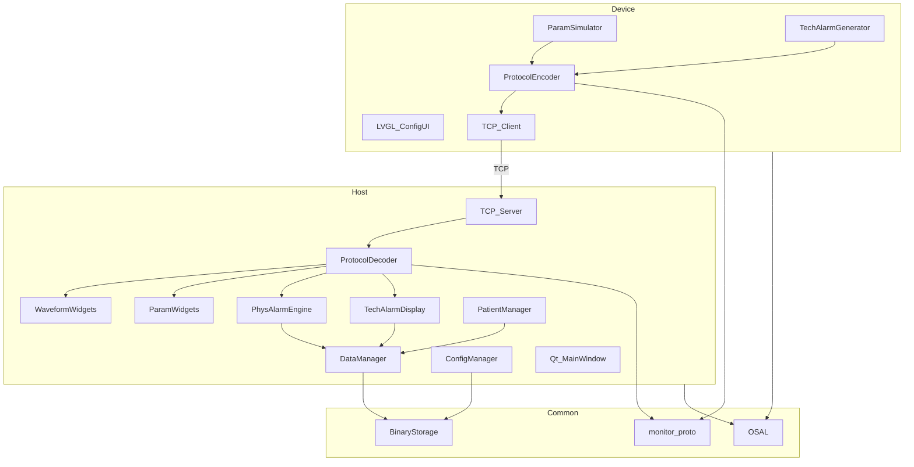
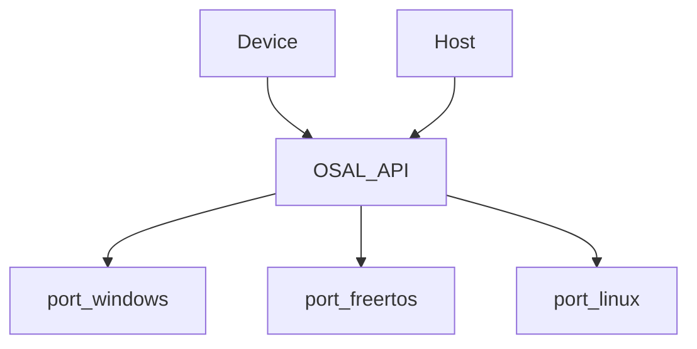
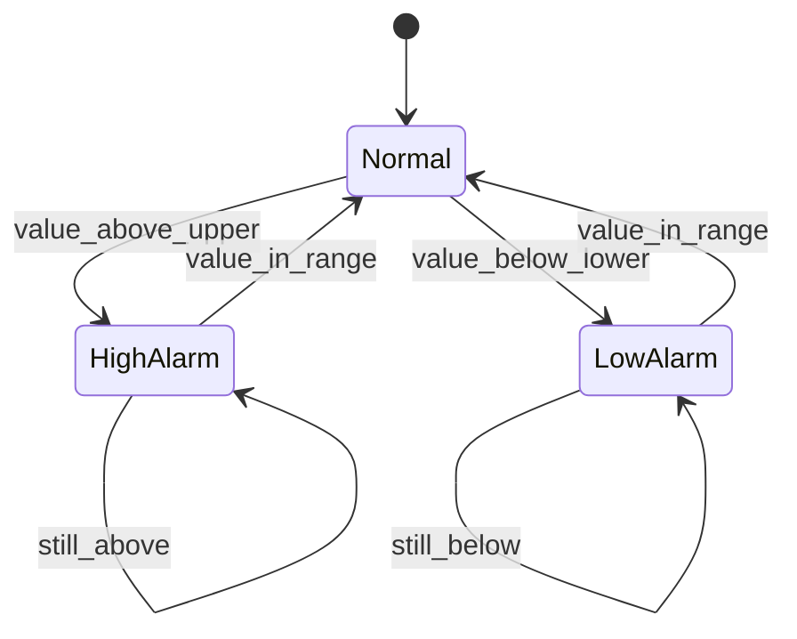
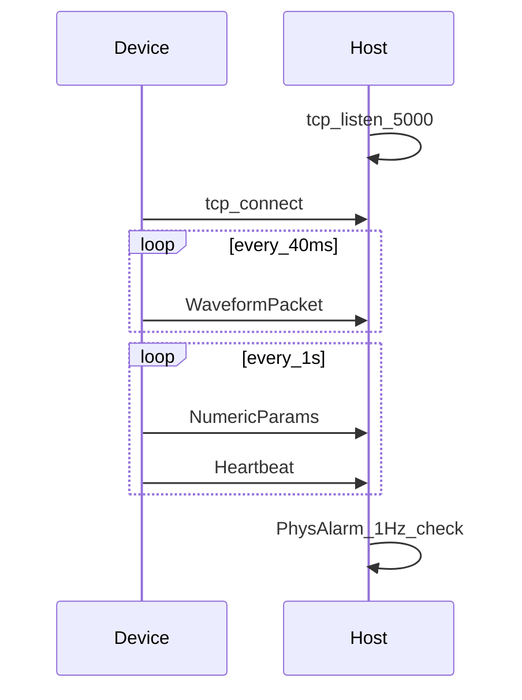
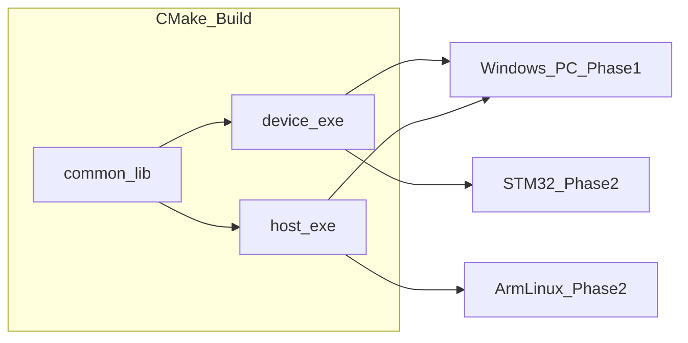

# Architecture Design Document

**Project:** MiniPatientMonitor  
**Version:** 0.1  
**Date:** 2026-06-20

---

## 1. Architecture Overview

MiniPatientMonitor uses a **dual-process** design with a shared **common layer** (OSAL, Protobuf, storage). Phase 1 targets **Windows**; phase 2 ports Device to **FreeRTOS/STM32** and Host to **Arm Linux**.



---

## 2. OS Abstraction Layer (OSAL)

### 2.1 Design Goal

Allow Device and Host to share business logic headers while swapping platform implementations.



### 2.2 API Surface (`common/osal/osal.h`)

```c
// Threading
osal_thread_t osal_thread_create(osal_thread_fn fn, void* arg, int priority, size_t stack);
void osal_thread_sleep_ms(uint32_t ms);
uint32_t osal_get_tick_ms(void);

// Sync
osal_mutex_t osal_mutex_create(void);
void osal_mutex_lock(osal_mutex_t m);
void osal_mutex_unlock(osal_mutex_t m);
bool osal_queue_send(osal_queue_t q, const void* item, uint32_t timeout_ms);
bool osal_queue_recv(osal_queue_t q, void* item, uint32_t timeout_ms);

// TCP
osal_socket_t osal_tcp_listen(const char* host, uint16_t port);
osal_socket_t osal_tcp_accept(osal_socket_t listener);
osal_socket_t osal_tcp_connect(const char* host, uint16_t port);
int osal_tcp_send(osal_socket_t s, const void* buf, size_t len);
int osal_tcp_recv(osal_socket_t s, void* buf, size_t len);

// File I/O
bool osal_file_read(const char* path, void* buf, size_t* inout_len);
bool osal_file_write(const char* path, const void* buf, size_t len);
bool osal_file_exists(const char* path);
```

### 2.3 Platform Mapping

| OSAL API | Windows | FreeRTOS | Linux |
|----------|---------|----------|-------|
| thread | `_beginthreadex` | `xTaskCreate` | `pthread_create` |
| mutex | `CRITICAL_SECTION` | `xSemaphoreCreateMutex` | `pthread_mutex` |
| queue | `std::queue`+mutex | `xQueue` | pipe/socket pair |
| tcp | Winsock2 | LwIP | BSD sockets |
| file | `fopen`/`fread` | FatFS | POSIX |

---

## 3. Device Architecture

### 3.1 Module Responsibilities

| Module | File (planned) | Responsibility |
|--------|----------------|----------------|
| `ParamSimulator` | `device/src/param_sim.cpp` | Sine/synthetic ECG, pleth, resp; numeric derivation |
| `TechAlarmGen` | `device/src/tech_alarm.cpp` | Inject LEAD_OFF, MODULE_FAULT events |
| `LVGL_ConfigUI` | `device/ui/config_ui.c` | Edit HR, SpO2, limits for demo |
| `ProtocolEncoder` | `common/proto/encoder.cpp` | Serialize Protobuf + length prefix |
| `NetClient` | `device/src/net_client.cpp` | TCP connect, send loop |

### 3.2 Task Model (FreeRTOS / Windows threads)

| Task | Priority | Period | Stack |
|------|----------|--------|-------|
| ParamTask | High (3) | 40 ms | 2 KB |
| NetTask | Normal (2) | event | 4 KB |
| UITask | Low (1) | 50 ms | 4 KB |
| AlarmTask | Normal (2) | 1000 ms | 1 KB |

### 3.3 Parameter Simulation (simplified)

- **ECG**: sum of sine waves ~1 Hz + harmonics + baseline wander
- **HR**: derived from R-R interval or configured default
- **SpO2/PR**: pleth sine modulated by HR
- **Resp**: slower sine ~0.2 Hz
- **NIBP**: periodic measurement cycle (demo: static 120/80/93)
- **Temp**: slow drift around 36.5 °C

---

## 4. Host Architecture

### 4.1 UI Layout (1024×768)

```
┌──────────────────────────────────────────────────────────────┐
│ TopBar 48px                                                  │
│  PatientInfo | PhysAlarm | Icons | TechAlarm | DateTime      │
├────────────────────────────────┬─────────────────────────────┤
│ WaveformPanel 696px (68%)       │ ParamPanel 328px (32%)      │
│  EcgLead2Widget                 │  HrParamRow (linked height) │
│  EcgLeadVWidget                 │  SpO2PrRow (SpO2 large)    │
│  PrPlethWidget                  │  RespParamRow             │
│  RespWaveWidget                 │  NibpParamRow               │
│                                 │  TempParamRow               │
├────────────────────────────────┴─────────────────────────────┤
│ BottomBar 56px — 6 shortcut buttons + dialogs                │
└──────────────────────────────────────────────────────────────┘
```

### 4.2 Module Responsibilities

| Module | Responsibility |
|--------|----------------|
| `NetworkReceiver` | TCP server, recv loop, push to `MessageQueue` |
| `WaveformWidgets` | Ring buffer → QPainter polyline, 25 Hz refresh |
| `ParamWidgets` | Numeric QLabel updates |
| `PhysAlarmEngine` | QTimer 1000 ms; compare numerics vs `AlarmLimits` |
| `TechAlarmDisplay` | Parse `TechAlarmEvent`, show in top bar |
| `PatientManager` | Admit/discharge state machine |
| `DataManager` | Append trend + alarm records |
| `ConfigManager` | Load/save factory & user bins |

### 4.3 Physiological Alarm State Machine



Evaluation rate: **1 Hz** (not per-sample).

### 4.4 Threading Model

| Thread | Affinity | Notes |
|--------|----------|-------|
| Qt GUI | Main | All QWidget updates via signals |
| NetThread | Worker | Blocks on recv; emits `messageReceived` |
| AlarmThread | Worker | 1 Hz timer; emits `alarmTriggered` |
| DataThread | Worker | Async file append |

---

## 5. Communication Protocol

### 5.1 Framing

```
┌────────────────┬─────────────────────────┐
│ Length (BE u32)│ Protobuf message bytes  │
└────────────────┴─────────────────────────┘
```

Max payload: 64 KB (configurable).

### 5.2 Protobuf Schema (draft `monitor.proto`)

```protobuf
syntax = "proto3";
package monitor;

message WaveformPacket {
  uint64 timestamp_ms = 1;
  repeated int32 ecg_lead_ii = 2;   // e.g. 40 samples
  repeated int32 ecg_lead_v = 3;
  repeated int32 pr_pleth = 4;
  repeated int32 resp_wave = 5;
}

message NumericParams {
  uint64 timestamp_ms = 1;
  uint32 hr = 2;
  uint32 spo2 = 3;
  uint32 pr = 4;
  uint32 resp_rate = 5;
  uint32 nibp_sys = 6;
  uint32 nibp_dia = 7;
  uint32 nibp_mean = 8;
  float temperature = 9;
}

message TechAlarmEvent {
  uint64 timestamp_ms = 1;
  enum Code { LEAD_OFF = 0; MODULE_FAULT = 1; COMM_ERROR = 2; }
  Code code = 2;
  string message = 3;
}

message Heartbeat {
  uint64 timestamp_ms = 1;
}

message Envelope {
  oneof payload {
    WaveformPacket waveform = 1;
    NumericParams numerics = 2;
    TechAlarmEvent tech_alarm = 3;
    Heartbeat heartbeat = 4;
  }
}
```

### 5.3 Connection Sequence



---

## 6. Storage Architecture

No database. Protobuf-serialized records appended to binary files.

| Path | Format | Writer |
|------|--------|--------|
| `config/factory.bin` | `FactoryConfig` proto | ConfigManager (factory mode) |
| `config/user.bin` | `UserConfig` proto | ConfigManager |
| `data/patients.idx` | `PatientIndex` proto | PatientManager |
| `data/{uuid}/trend.bin` | repeated `TrendRecord` | DataManager |
| `data/{uuid}/alarms.bin` | repeated `AlarmRecord` | DataManager |

`AlarmRecord` fields: timestamp, type (phys/tech), parameter, value, upper_limit, lower_limit.

---

## 7. Build & Deployment View



---

## 8. Security & Safety Notes

- Bind TCP to localhost in development (`127.0.0.1`)
- Display **DEMO ONLY** watermark on Host UI
- No real patient PHI in test data

---

## 9. Open Issues

| ID | Issue | Resolution Target |
|----|-------|-------------------|
| AR-01 | NIBP measurement cycle timing | M2 |
| AR-02 | Waveform ring buffer size vs 25 Hz | M2 |
| AR-03 | Patient merge semantics | M4 |
| AR-04 | FreeRTOS LwIP buffer counts | M7 |