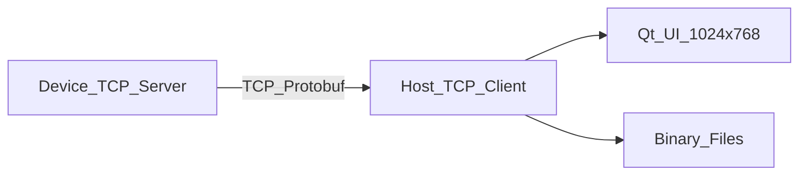

# Software Requirements Specification (SRS)

**Project:** MiniPatientMonitor  
**Version:** 0.2  
**Date:** 2026-06-21  
**Status:** Draft  
**Safety Class (IEC 62304):** Not applicable — demonstration software, not for clinical use

---

## 1. Introduction

### 1.1 Purpose

This document specifies software requirements for MiniPatientMonitor, a six-parameter patient monitor **demonstration** consisting of a Device (parameter-module simulator) and a Host (monitor main application).

### 1.2 Scope

| In Scope | Out of Scope |
|----------|--------------|
| Six vital-sign channels (ECG/HR, SpO2/PR, Resp, NIBP, Temp) | Clinical accuracy, regulatory submission |
| Device-Host TCP/Protobuf communication | HL7, central station, drug calculations |
| Host UI, alarming, patient/data/config management | Multi-module hot-plug |
| **Phase 1:** x86 Windows + Linux application layer | TLS/network encryption (phase 2) |
| **Phase 2:** STM32+FreeRTOS (Device), AM3358+ArmLinux (Host) | |
| Binary file persistence | Database storage |
| 12-lead ECG simulation; UI default Lead II + V1 | |

### 1.3 Definitions

| Term | Definition |
|------|------------|
| Device | Parameter-module firmware simulator process (TCP **Server**) |
| Host | Patient monitor main application process (TCP **Client**) |
| Physiological alarm | Alarm triggered when numeric parameter exceeds configured limits |
| Technical alarm | Alarm reported by Device (e.g. lead off, module fault) |
| OSAL | Operating System Abstraction Layer |
| Parameter module | Independent hardware board simulating one vital-sign channel |

### 1.4 References

- IEC 62304 (informative — documentation style only)
- ISO 14971 (informative — risk analysis)
- Project plan: `Project_MiniPatientMonitor.md`
- Design adjustment: Comment/05.ProjectAdjust01.txt

---

## 2. System Overview

The system comprises two processes communicating over TCP. Device runs as **TCP Server** on port 5000; Host connects as **Client**. Device generates simulated vital signs from **five independent module simulators** and optional technical alarms. Host displays waveforms and numerics, evaluates physiological alarms at 1 Hz, manages patients, and persists data to binary files.

### 2.1 Development Phases

| Phase | Platform | Goal |
|-------|----------|------|
| Phase 1 | x86 Windows + Linux | Application-layer features via OSAL |
| Phase 2 | STM32 + FreeRTOS (Device); AM3358 + ArmLinux (Host) | Hardware bring-up and integration |

---

## 3. Functional Requirements — Device

### FR-D01 TCP Streaming

**Description:** Device shall run independently as **TCP Server** and accept connections from Host.

| Attribute | Value |
|-----------|-------|
| Priority | P0 |
| Acceptance | Device listens on `127.0.0.1:5000`; Host connects within 5 s of startup; connection recoverable after drop |

### FR-D02 Six-Parameter Simulation (Independent Modules)

**Description:** Device shall simulate five independent parameter modules, each transmitting its own packet type:

| Module | Packet | Waveform | Numeric |
|--------|--------|----------|---------|
| ECG | `EcgPacket` | 12 leads: I, II, III, aVR, aVL, aVF, V1–V6 | HR (bpm) |
| SpO2 | `Spo2Packet` | Plethysmograph | SpO2 (%), PR (bpm) |
| Resp | `RespPacket` | Respiratory wave | Resp rate (/min) |
| Temp | `TempPacket` | Temperature wave | Temperature (0.1°C integer; 365 = 36.5°C) |
| NIBP | `NibpPacket` | — | Sys/Mean/Dia (mmHg) |

| Attribute | Value |
|-----------|-------|
| Priority | P0 |
| Acceptance | All modules active; packets sent independently; HR default 72 bpm; Host UI defaults to ECG Lead II + V1; values within clinically plausible demo ranges |

### FR-D03 Configuration UI (LVGL)

**Description:** Device shall provide a local UI to modify default parameter values (e.g. HR 72 → 148).

| Attribute | Value |
|-----------|-------|
| Priority | P0 |
| Acceptance | Changed value reflected in next module packet (e.g. `EcgPacket.hr`) |

### FR-D04 Technical Alarms

**Description:** Device shall generate and transmit technical alarm events with one or more alarm codes.

| Attribute | Value |
|-----------|-------|
| Priority | P0 |
| Acceptance | `TechAlarmEvent` uses `repeated Code` (no message string); at least LEAD_OFF, MODULE_FAULT; Host localizes display text |

### FR-D05 Heartbeat / Reconnect

**Description:** Device shall send periodic heartbeat via `Envelope` with `NullPacket` payload; Host shall reconnect on disconnect.

| Attribute | Value |
|-----------|-------|
| Priority | P1 |
| Acceptance | Heartbeat every 1 s with `Heartbeat.timestamp_ms`; Host reconnects within 10 s |

---

## 4. Functional Requirements — Host

### FR-H01 Main Layout (1024×768)

**Description:** Host UI resolution shall be 1024×768 with pixel-defined regions:

| Region | Coordinates | Size |
|--------|-------------|------|
| TopBar | (0,0)–(1023,51) | 1024×52 |
| WaveformPanel | (0,52)–(891,711) | 892×660 |
| ParamPanel | (892,52)–(1023,711) | 132×660 |
| BottomBar | (0,712)–(1023,767) | 1024×56 |

| Attribute | Value |
|-----------|-------|
| Priority | P0 |

### FR-H02 Top Status Bar

Left to right (pixel widths):

1. Patient info — 188 px (name + bed number, two lines)
2. Physiological alarm — 300 px
3. Alarm icons — 52 px
4. Technical alarm — 300 px
5. System date and time — 188 px (date + time, two lines)

| Attribute | Value |
|-----------|-------|
| Priority | P0 |

### FR-H03 Waveform Area

Top to bottom (132 px per row):

1. ECG Lead II
2. ECG Lead V1 (default; lead switch planned)
3. PR pleth
4. Respiratory
5. Temperature waveform

| Attribute | Value |
|-----------|-------|
| Priority | P0 |
| Refresh | ≥ 25 Hz |

### FR-H04 Parameter Area & Association Rules

Top to bottom:

| Row | Parameter | Association | Display Rule |
|-----|-----------|-------------|--------------|
| 1 | HR | ECG | Same row height as ECG block; side-by-side alignment |
| 2 | NIBP | — | Value only |
| 3 | SpO2 + PR | PR pleth | SpO2 larger font left, PR smaller right |
| 4 | Resp | Resp wave | Linked numeric |
| 5 | Temp | Temp wave | Display as °C float; stored/transmitted as 0.1°C integer |

| Attribute | Value |
|-----------|-------|
| Priority | P0 |

### FR-H05 Bottom Shortcut Bar

8 equal slots (128 px each):

`[Page Left][Admit/Discharge][Events][Review][Config][Sound][Standby][Page Right]`

Middle 6 buttons open appropriate dialogs.

| Attribute | Value |
|-----------|-------|
| Priority | P0 |

### FR-H06 Physiological Alarming

**Description:** Host shall evaluate numeric parameters against alarm limits at **1 Hz**.

| Attribute | Value |
|-----------|-------|
| Priority | P0 |
| Acceptance | When HR > upper limit (e.g. 148 vs limit 120), phys alarm area shows parameter name, value, and limit |

### FR-H07 Technical Alarming

**Description:** Host shall display technical alarms received from Device, localizing `TechAlarmEvent.code` to user-visible strings.

| Attribute | Value |
|-----------|-------|
| Priority | P0 |

### FR-H08 Data Management

**Description:** Host shall store waveforms, numerics, and alarm events indexed by patient.

Alarm record shall include: timestamp, alarm type, parameter value, configured limits.

| Attribute | Value |
|-----------|-------|
| Priority | P1 |

### FR-H09 Configuration Management

**Description:** Host shall support factory settings, user settings, load/save, restore factory defaults.

| Attribute | Value |
|-----------|-------|
| Priority | P1 |

### FR-H10 Patient Management

**Description:** Host shall support admit, discharge, export patient data, merge patient records.

| Attribute | Value |
|-----------|-------|
| Priority | P1 |
| Acceptance | At least one active patient at a time in MVP |

---

## 5. Functional Requirements — Common

### FR-C01 OS Abstraction Layer

Device and Host shall compile against common OSAL API with platform ports:

- **Phase 1:** Windows + Linux (x86)
- **Phase 2:** FreeRTOS (STM32 Device), ArmLinux (AM3358 Host)

| Priority | P0 |

### FR-C02 Protobuf Data Definitions

All structured messages shall be defined in `common/proto/monitor.proto`. `Envelope` shall always include `Heartbeat`; module data via `oneof payload`.

| Priority | P0 |

### FR-C03 Binary File Storage

Configuration and patient data shall use binary files (no SQL database), simulating EEPROM/FLASH storage.

| File | Content |
|------|---------|
| `config/factory.bin` | Factory defaults |
| `config/user.bin` | User settings |
| `data/patients.idx` | Patient index |
| `data/{id}/trend.bin` | Trend data |
| `data/{id}/alarms.bin` | Alarm events |

| Priority | P1 |

---

## 6. Non-Functional Requirements

| ID | Category | Requirement | Acceptance |
|----|----------|-------------|------------|
| NFR-01 | Performance | Waveform refresh ≥ 25 Hz | Measured via log counter |
| NFR-02 | Performance | Alarm evaluation 1 Hz | Timer audit |
| NFR-03 | Reliability | Watchdog reset logging (MCU phase) | Log entry after reset |
| NFR-04 | Maintainability | Core module unit test coverage ≥ 60% | lcov report |
| NFR-05 | Portability | Phase 1: x86 Windows + Linux; Phase 2: STM32 + AM3358 | CI green on Phase 1 |
| NFR-06 | Documentation | SRS, architecture, risk, test traceability | docs/ complete |

---

## 7. External Interfaces

### 7.1 Network

| Parameter | Value |
|-----------|-------|
| Protocol | TCP |
| Device role | **Server** (listen) |
| Host role | **Client** (connect) |
| Default address | 127.0.0.1:5000 |
| Framing | 4-byte big-endian length + Protobuf `Envelope` |
| Startup order | Device first, then Host |

### 7.2 User Interfaces

| Process | Toolkit | Resolution |
|---------|---------|------------|
| Device | LVGL 9 (+ SDL on Windows) | 320×240 (config panel) |
| Host | Qt 6 Widgets | 1024×768 |

---

## 8. Constraints

- C++17 minimum
- No clinical validation
- No Mindray proprietary IP
- Demonstration / portfolio use only

---

## 9. Traceability

See [TraceabilityMatrix.md](TraceabilityMatrix.md) for FR → test case mapping.

---

## 10. Change History

| Version | Date | Change |
|---------|------|--------|
| 0.1 | 2026-06-20 | Initial SRS |
| 0.2 | 2026-06-21 | Comment/05: phases, Device=Server, module packets, 12-lead ECG, pixel UI |