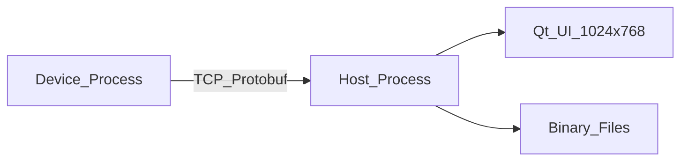

# Software Requirements Specification (SRS)

**Project:** MiniPatientMonitor  
**Version:** 0.1  
**Date:** 2026-06-20  
**Status:** Draft  
**Safety Class (IEC 62304):** Not applicable — demonstration software, not for clinical use

---

## 1. Introduction

### 1.1 Purpose

This document specifies software requirements for MiniPatientMonitor, a six-parameter patient monitor **demonstration** consisting of a Device (parameter-module simulator) and a Host (monitor main application).

### 1.2 Scope

| In Scope | Out of Scope |
|----------|--------------|
| Six vital-sign channels (ECG/HR, SpO2/PR, Resp, NIBP, Temp) | Clinical accuracy, regulatory submission |
| Device-Host TCP/Protobuf communication | HL7, central station, drug calculations |
| Host UI, alarming, patient/data/config management | Multi-module hot-plug |
| OS abstraction for Windows / FreeRTOS / Linux | TLS/network encryption (phase 2) |
| Binary file persistence | Database storage |

### 1.3 Definitions

| Term | Definition |
|------|------------|
| Device | Parameter-module firmware simulator process |
| Host | Patient monitor main application process |
| Physiological alarm | Alarm triggered when numeric parameter exceeds configured limits |
| Technical alarm | Alarm reported by Device (e.g. lead off, module fault) |
| OSAL | Operating System Abstraction Layer |

### 1.4 References

- IEC 62304 (informative — documentation style only)
- ISO 14971 (informative — risk analysis)
- Project plan: `Project_MiniPatientMonitor.md`

---

## 2. System Overview

The system comprises two processes communicating over TCP. Device generates simulated vital signs and optional technical alarms. Host displays waveforms and numerics, evaluates physiological alarms at 1 Hz, manages patients, and persists data to binary files.

---

## 3. Functional Requirements — Device

### FR-D01 TCP Streaming

**Description:** Device shall run independently and stream vital-sign data to Host over TCP.

| Attribute | Value |
|-----------|-------|
| Priority | P0 |
| Acceptance | Device connects to Host within 5 s of startup; connection recoverable after drop |

### FR-D02 Six-Parameter Simulation

**Description:** Device shall generate simulated data for:

| Channel | Waveform | Numeric |
|---------|----------|---------|
| ECG | Lead II, Lead V | HR (bpm) |
| SpO2 | — | SpO2 (%) |
| PR | Plethysmograph | PR (bpm) |
| Resp | Respiratory wave | Resp rate (/min) |
| NIBP | — | Sys/Dia/Mean (mmHg) |
| Temp | — | Temperature (°C) |

| Attribute | Value |
|-----------|-------|
| Priority | P0 |
| Acceptance | All channels active; HR default 72 bpm; values within clinically plausible demo ranges |

### FR-D03 Configuration UI (LVGL)

**Description:** Device shall provide a local UI to modify default parameter values (e.g. HR 72 → 148).

| Attribute | Value |
|-----------|-------|
| Priority | P0 |
| Acceptance | Changed value reflected in next transmitted NumericParams packet |

### FR-D04 Technical Alarms

**Description:** Device shall generate and transmit technical alarm events.

| Attribute | Value |
|-----------|-------|
| Priority | P0 |
| Acceptance | At least: LEAD_OFF, MODULE_FAULT; displayed in Host tech alarm area |

### FR-D05 Heartbeat / Reconnect

**Description:** Device shall send periodic heartbeat; reconnect on disconnect.

| Attribute | Value |
|-----------|-------|
| Priority | P1 |
| Acceptance | Heartbeat every 1 s; reconnect within 10 s |

---

## 4. Functional Requirements — Host

### FR-H01 Main Layout (1024×768)

**Description:** Host UI resolution shall be 1024×768 with:

- Top status bar (~48 px)
- Middle content: waveform area (68% width) + parameter area (32% width)
- Bottom shortcut bar (~56 px)

| Attribute | Value |
|-----------|-------|
| Priority | P0 |

### FR-H02 Top Status Bar

Left to right:

1. Patient info (name + bed number, two lines)
2. Physiological alarm message area
3. Alarm icons
4. Technical alarm message area
5. System date and time

| Attribute | Value |
|-----------|-------|
| Priority | P0 |

### FR-H03 Waveform Area

Top to bottom:

1. ECG Lead II
2. ECG Lead V
3. PR pleth
4. Respiratory

| Attribute | Value |
|-----------|-------|
| Priority | P0 |
| Refresh | ≥ 25 Hz |

### FR-H04 Parameter Area & Association Rules

| Parameter | Association | Display Rule |
|-----------|-------------|--------------|
| HR | ECG | Same row height as ECG block; side-by-side alignment |
| SpO2 + PR | PR pleth | Same row; SpO2 larger font left, PR smaller right |
| Resp | Resp wave | Linked numeric |
| NIBP | — | Value only, no waveform |
| Temp | — | Value only, no waveform |

| Attribute | Value |
|-----------|-------|
| Priority | P0 |

### FR-H05 Bottom Shortcut Bar

Buttons left to right:

1. Admit / Discharge patient
2. View events
3. Data review
4. Configuration
5. Sound settings
6. Standby

Each opens appropriate dialog.

| Attribute | Value |
|-----------|-------|
| Priority | P0 |

### FR-H06 Physiological Alarming

**Description:** Host shall evaluate numeric parameters against alarm limits at **1 Hz**.

| Attribute | Value |
|-----------|-------|
| Priority | P0 |
| Acceptance | When HR > upper limit (e.g. 148 vs limit 120), phys alarm area shows parameter name, value, and limit |

### FR-H07 Technical Alarming

**Description:** Host shall display technical alarms received from Device.

| Attribute | Value |
|-----------|-------|
| Priority | P0 |

### FR-H08 Data Management

**Description:** Host shall store waveforms, numerics, and alarm events indexed by patient.

Alarm record shall include: timestamp, alarm type, parameter value, configured limits.

| Attribute | Value |
|-----------|-------|
| Priority | P1 |

### FR-H09 Configuration Management

**Description:** Host shall support factory settings, user settings, load/save, restore factory defaults.

| Attribute | Value |
|-----------|-------|
| Priority | P1 |

### FR-H10 Patient Management

**Description:** Host shall support admit, discharge, export patient data, merge patient records.

| Attribute | Value |
|-----------|-------|
| Priority | P1 |
| Acceptance | At least one active patient at a time in MVP |

---

## 5. Functional Requirements — Common

### FR-C01 OS Abstraction Layer

Device and Host shall compile against common OSAL API with platform ports: Windows (phase 1), FreeRTOS, Linux (phase 2).

| Priority | P0 |

### FR-C02 Protobuf Data Definitions

All structured messages shall be defined in `common/proto/monitor.proto` and generated for both processes.

| Priority | P0 |

### FR-C03 Binary File Storage

Configuration and patient data shall use binary files (no SQL database), simulating EEPROM/FLASH storage.

| File | Content |
|------|---------|
| `config/factory.bin` | Factory defaults |
| `config/user.bin` | User settings |
| `data/patients.idx` | Patient index |
| `data/{id}/trend.bin` | Trend data |
| `data/{id}/alarms.bin` | Alarm events |

| Priority | P1 |

---

## 6. Non-Functional Requirements

| ID | Category | Requirement | Acceptance |
|----|----------|-------------|------------|
| NFR-01 | Performance | Waveform refresh ≥ 25 Hz | Measured via log counter |
| NFR-02 | Performance | Alarm evaluation 1 Hz | Timer audit |
| NFR-03 | Reliability | Watchdog reset logging (MCU phase) | Log entry after reset |
| NFR-04 | Maintainability | Core module unit test coverage ≥ 60% | lcov report |
| NFR-05 | Portability | Windows build phase 1 | CI green |
| NFR-06 | Documentation | SRS, architecture, risk, test traceability | docs/ complete |

---

## 7. External Interfaces

### 7.1 Network

| Parameter | Value |
|-----------|-------|
| Protocol | TCP |
| Device role | Client |
| Host role | Server |
| Default address | 127.0.0.1:5000 |
| Framing | 4-byte big-endian length + Protobuf payload |

### 7.2 User Interfaces

| Process | Toolkit | Resolution |
|---------|---------|------------|
| Device | LVGL 9 (+ SDL on Windows) | 320×240 (config panel) |
| Host | Qt 6 Widgets | 1024×768 |

---

## 8. Constraints

- C++17 minimum
- No clinical validation
- No Mindray proprietary IP
- Demonstration / portfolio use only

---

## 9. Traceability

See [TraceabilityMatrix.md](TraceabilityMatrix.md) for FR → test case mapping.